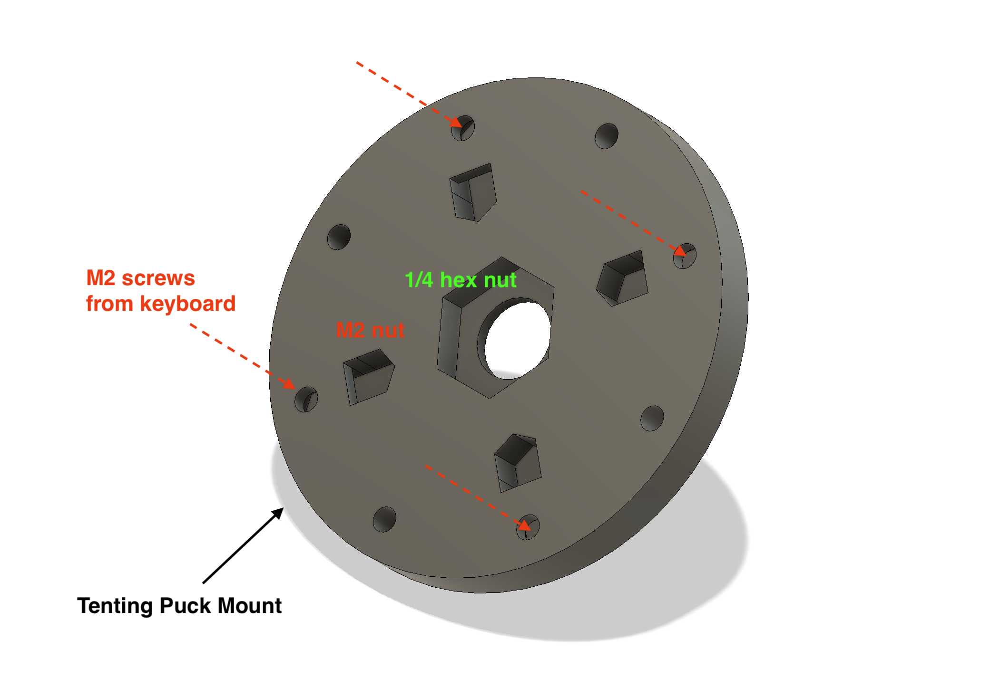
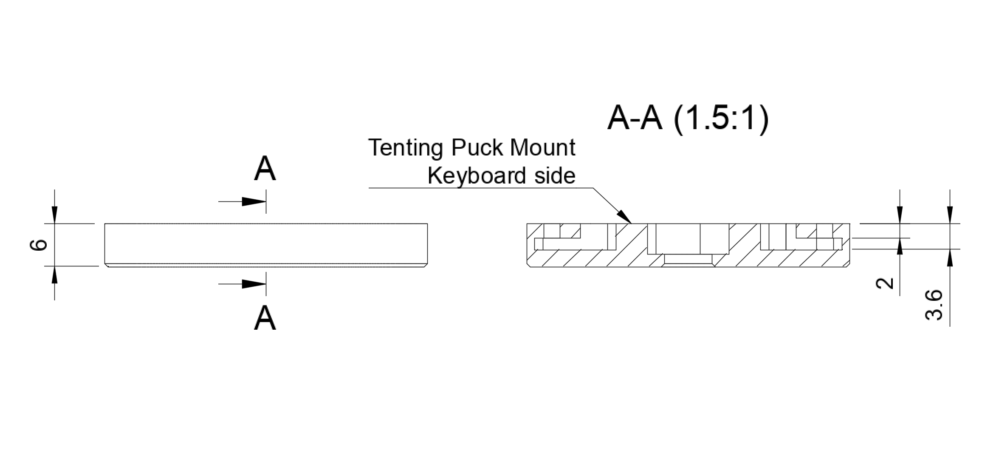
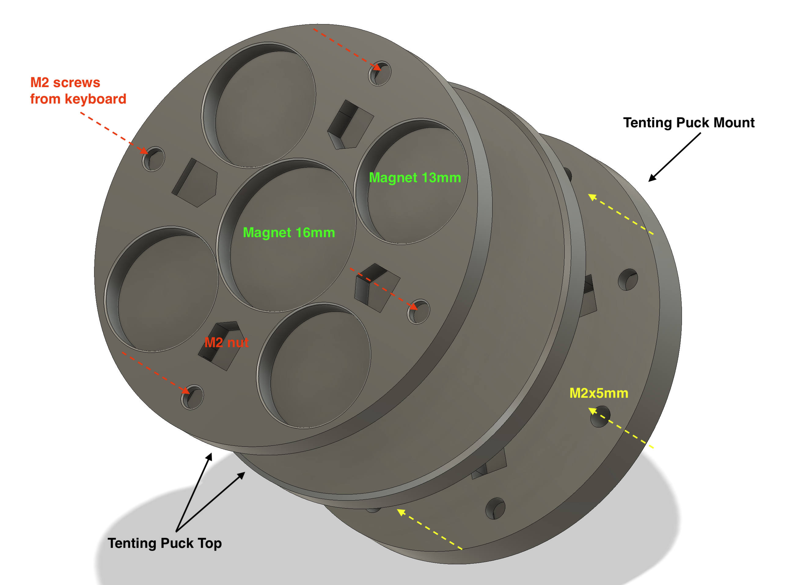
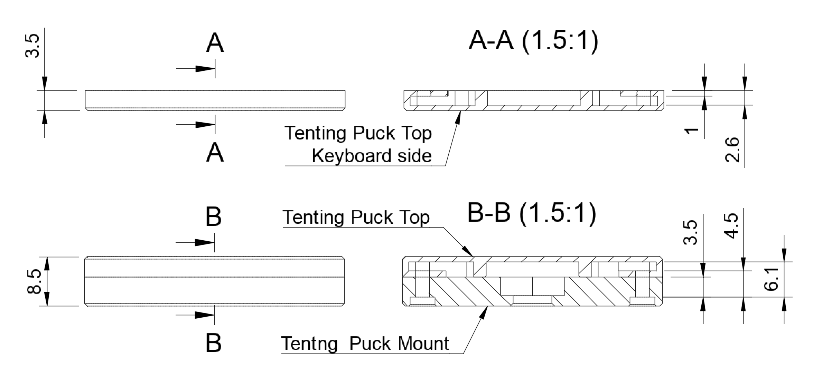
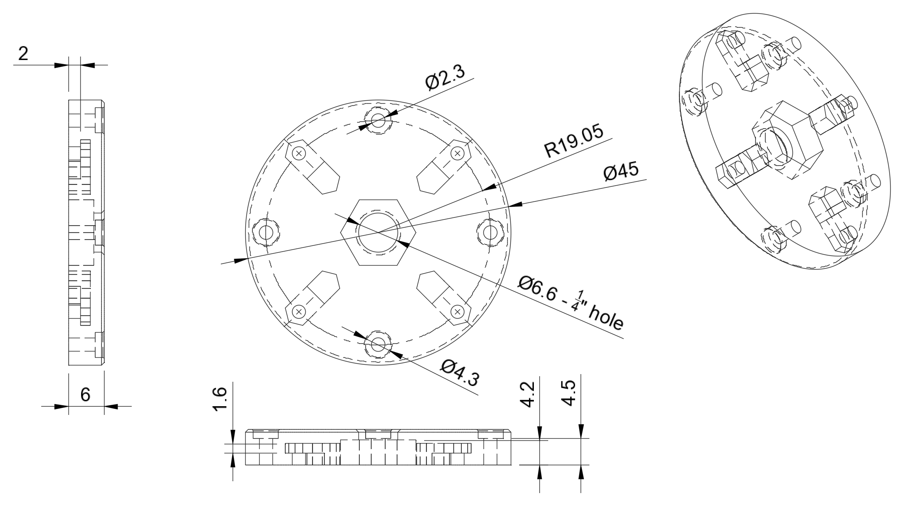
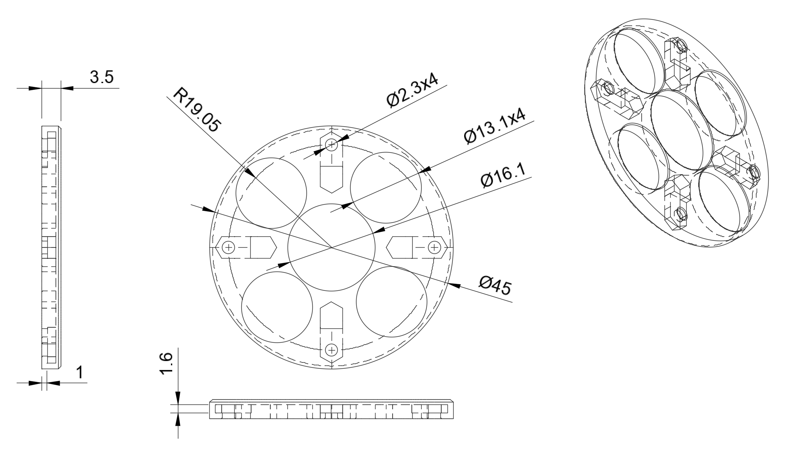

# Magnet Tenting Puck for split keyboards

Inspired by [tenting puck](https://splitkb.com/products/tenting-puck) from [splitkb.com](https://splitkb.com).

## How-To: without magnets

1. Required parts
   - [Tenting Puck Mount](3d-printing/stl/TP-SLA-Mount.stl) x 2
   - Screw:
     - Keyboard case : make sure to choose M2 screw with enough length.  
       Consider to add 3mm to thickness of your case. 
   - Nuts:
     - M2 flat hex nut (thin) x 8
     - 1/4-20 UNC flat hex nut x 2
1. Print Tenting Puck Mounts.  Resin printing is recommended.
1. Tenting Puck Mount
   1. Place 1/4 nut into the hole.
   1. Insert M2 nuts into the holes, and move it to align with the screw hole.
   1. Align screw holes from Mount and your keyboard case or plate.
   1. Insert M2 screws from your keyboard case and screw it.
   1. Install it to any camera tri-pod.
   
   
1. Enjoy!

## How-To: with magnets

1. Required parts
   - [Tenting Puck Top v1](3d-printing/stl/TP-SLA-Top-16x2-13x2.stl) x 4
     - Magnets
       - 16mm x 2 mm x 4
       - 13mm x 2 mm x 16 (optional)
     - [Tenting Puck Top v2](3d-printing/stl/TP-SLA-Top-15x2-12x2.stl) uses smallier magenets: 15mm and 12mm
   - [Tenting Puck Mount](3d-printing/stl/TP-SLA-Mount.stl) x 2
   - Screw:
     - tenting parts : M2 x 8mm x 8
     - Keyboard case : make sure to choose M2 screw with enough length.  
       Consider to add 2mm to thickness of your case. 
   - Nuts:
     - M2 flat hex nut (thin) x 16
     - 1/4-20 UNC flat hex nut x 2
1. Print Tenting Puck Tops and Mounts.  Resin printing is recommended.
1. Tenting Puck Top
   1. Insert magnets into holes on Tenting Puck Top
   1. Insert M2 nuts into the holes, and move it to align with the screw hole.
   1. We need two of this for each side.  
1. Tenting Puck Mount
   1. Place 1/4 nut into the hole.
   1. Align screw holes from Mount and one of Tenting Tops.
   1. Insert M2 screws from Tenting Mount and screw it.
   1. Install it to any camera tri-pod.
1. Attach one of Tenting Tops to your kenboard case with M2 screws.
   
   
1. Enjoy!

## Tenting Puck Mount
   
## Tenting Puck Top
   

